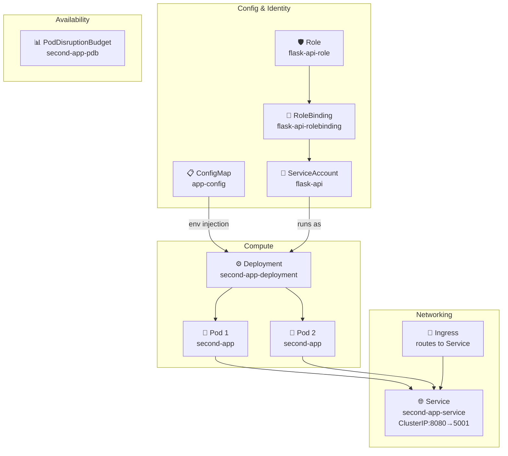

# Lab 02: Second App — Production-Grade Kubernetes Deployment

## Why This Lab Exists

Lab 01 taught you the basics of a single Deployment + Service. Lab 02 takes that foundation and adds **every production concern** you'll need when real traffic hits your app:

- **Configuration externalization** (ConfigMap) so you can change behavior without rebuilding images
- **Identity isolation** (RBAC) so your pod can only do what it absolutely needs
- **Availability guarantees** (PDB) so maintenance doesn't cause downtime
- **Intelligent scheduling** (Affinity + Anti-Affinity + Topology Spread) so pods spread across nodes for resilience
- **Health orchestration** (Startup + Liveness + Readiness probes) so Kubernetes knows exactly when a pod is ready to serve or needs a restart
- **Resource governance** (Requests/Limits) so your pods can't starve other workloads
- **Security hardening** (Security Context + ReadOnlyFS) so even if the app is compromised, the container is locked down

---

## Architecture Overview



### Deploy Order (Dependency Chain)

Resources must be applied in order because later resources reference earlier ones:

```bash
# 1. ConfigMap       → referenced by Deployment (env)
# 2. RBAC            → referenced by Deployment (serviceAccountName)
# 3. PDB             → references Deployment's pod labels
# 4. Deployment      → creates pods with the above resources
# 5. Service         → discovers Deployment's pods via selector
```

```bash
kubectl apply -f flask-configmap.yaml   # Step 1: Config
kubectl apply -f flask-rbac.yaml        # Step 2: Identity
kubectl apply -f flask-pdb.yaml         # Step 3: Availability guard
kubectl apply -f deployment.yaml        # Step 4: Compute
kubectl apply -f service.yaml           # Step 5: Networking
```

---

## File: `flask-configmap.yaml`

### What It Is

A **ConfigMap** — a Kubernetes object that stores non-secret configuration data as key-value pairs. The Deployment reads these values and injects them into the pod's environment at startup.

### Why We Need It

Without a ConfigMap, configuration lives inside the Deployment YAML or, worse, baked into the Docker image. This means:
- Changing a port or environment name requires a **new image build + new Deployment** → slow, error-prone.
- With a ConfigMap, you change the YAML and restart pods → **zero rebuild, instant rollout**.

### Parameter-by-Parameter

| Parameter | Value | Why |
|---|---|-|
| `apiVersion: v1` | `v1` | Core Kubernetes API for built-in objects like ConfigMap, Service, Secret |
| `kind: ConfigMap` | `ConfigMap` | Tells Kubernetes this resource stores raw config data (not compute) |
| `metadata.name` | `app-config` | The name used by the Deployment's `configMapKeyRef` to look up values |
| `metadata.namespace` | `default` | Keeps the ConfigMap in the same namespace as the Deployment; cross-namespace references require a fully qualified name |
| `data.ENVIRONMENT_TYPE` | `"production"` | The app reads this to determine debug mode. `production` disables Flask's debug panel and enables hardened behavior. Changing to `"development"` re-enables hot-reload and error pages |
| `data.SERVER_PORT` | `"5001"` | The Flask app reads this to bind its listener. If you ever need to shift the app to port 5002, you update this single value and restart — no Deployment YAML changes needed |

### How the Deployment Consumes It

```yaml
# In deployment.yaml, under containers[].env:
- name: APP_ENV
  valueFrom:
    configMapKeyRef:
      name: app-config      # ← matches metadata.name above
      key: ENVIRONMENT_TYPE # ← reads the ENVIRONMENT_TYPE value
```

---

## File: `flask-rbac.yaml`

### What It Is

Three RBAC resources (ServiceAccount, Role, RoleBinding) chained together with `---` document separators. Together they create a **least-privilege identity** for the pod.

### Why We Need It

By default, every pod in a namespace runs as the `default` ServiceAccount, which has broad permissions. If your app has a vulnerability, an attacker can use those permissions to enumerate all pods, secrets, and services in the namespace. This file restricts the pod's identity to **only what it needs**.

### The Three Resources

#### 1. ServiceAccount (`flask-api`)

| Parameter | Value | Why |
|---|---|-|
| `apiVersion: v1` | `v1` | Core API group |
| `kind: ServiceAccount` | `ServiceAccount` | A Kubernetes identity object (like a username) that pods can assume |
| `metadata.name` | `flask-api` | The identity name; referenced in the Deployment via `serviceAccountName: flask-api` |
| `metadata.namespace` | `default` | Scope the identity to the `default` namespace only |

**Why a ServiceAccount at all?** — It's the pod's "username" in Kubernetes. The Deployment attaches it so every API call the pod makes (from within the cluster) authenticates as `flask-api`, not `default`.

#### 2. Role (`flask-api-role`)

| Parameter | Value | Why |
|---|---|-|
| `apiVersion` | `rbac.authorization.k8s.io/v1` | The RBAC API group — separate from core resources |
| `kind: Role` | `Role` | A namespace-scoped permission set (vs. ClusterRole which spans all namespaces) |
| `metadata.name` | `flask-api-role` | The role name referenced by the RoleBinding |
| `rules[0].apiGroups` | `[""]` | Empty string = core API group (includes Pods, Services, ConfigMaps, etc.) |
| `rules[0].resources` | `["pods"]` | **Least privilege**: the app only needs to read its own pod's status. No secrets, no deployments, no namespaces |
| `rules[0].verbs` | `["get", "list", "watch"]` | Read-only access. The app can check if its own pod is running but cannot create, delete, or modify anything |

**Why `get/list/watch` only?** — The app needs to introspect its environment (e.g., "am I the leader?", "what pods are running?"). It never needs to write.

#### 3. RoleBinding (`flask-api-rolebinding`)

| Parameter | Value | Why |
|---|---|-|
| `apiVersion` | `rbac.authorization.k8s.io/v1` | RBAC API group |
| `kind: RoleBinding` | `RoleBinding` | Links a Role's permissions to a specific identity (ServiceAccount) |
| `metadata.name` | `flask-api-rolebinding` | The binding name; Kubernetes uses this to find the association |
| `metadata.namespace` | `default` | Must match the Role's namespace |
| `subjects[0].kind` | `ServiceAccount` | The entity being granted permissions |
| `subjects[0].name` | `flask-api` | Must match the ServiceAccount created above |
| `subjects[0].namespace` | `default` | The ServiceAccount lives here |
| `roleRef.kind` | `Role` | Which type of role we're binding to |
| `roleRef.name` | `flask-api-role` | The specific Role whose permissions apply |
| `roleRef.apiGroup` | `rbac.authorization.k8s.io` | The RBAC API group |

**Why RoleBinding over ClusterRoleBinding?** — Namespace-scoped. The permissions only apply within `default`. If you moved this app to another namespace, you'd need a new RoleBinding — by design, permissions don't leak.

#### The `---` Separator

Each `---` is a YAML document separator. It lets `kubectl apply -f flask-rbac.yaml` deploy all three resources in a single command, in order.

---

## File: `flask-pdb.yaml`

### What It Is

A **PodDisruptionBudget** — a Kubernetes policy that guarantees a minimum number of your pods stay available during voluntary disruptions (node drains, cluster upgrades, autoscaler scale-down).

### Why We Need It

Without a PDB, when you run `kubectl drain` on a node (or when the cluster autoscaler decides to remove a node), Kubernetes will kill **all** your pods on that node simultaneously. If you only have 2 replicas, you just had an outage.

A PDB tells Kubernetes: *"Do NOT evict my pods below X"* — so it will drain nodes gradually, waiting for replacement pods to be ready first.

### Parameter-by-Parameter

| Parameter | Value | Why |
|---|---|-|
| `apiVersion: policy/v1` | `policy/v1` | The API group for policy resources like PDB |
| `kind: PodDisruptionBudget` | `PodDisruptionBudget` | The resource that enforces availability guarantees |
| `metadata.name` | `second-app-pdb` | Identifier for this budget; visible in `kubectl get pdb` |
| `metadata.namespace` | `default` | Scope to the same namespace as the Deployment |
| `spec.maxUnavailable` | `1` | **The core guarantee**: during voluntary disruptions, at most 1 pod can be unavailable at a time. Since we have 2 replicas, at least 1 will always be running. If you scale to 5 replicas, you could set `maxUnavailable: 2` (keeping 3 alive) |
| `spec.selector.matchLabels.app` | `second-app` | **Links the PDB to your Deployment**. The PDB monitors all pods with `app: second-app` — if the label changes, the PDB stops working silently. Always double-check this matches your Deployment's pod template labels |

**Note**: You can use either `maxUnavailable` or `minAvailable` (not both). `maxUnavailable: 1` is equivalent to `minAvailable: replicas - 1`.

**What this solves**: Cluster upgrades, node failures, and autoscaling events no longer cause complete service outages.

---

## File: `deployment.yaml`

### What It Is

A **Deployment** — the primary workload controller for stateless applications. It manages ReplicaSets, which in turn manage Pods. The Deployment handles creation, updating, scaling, and rollback.

### Why We Need It

Pods alone are ephemeral — if a pod dies, it's gone. A Deployment **recreates** pods automatically, ensures the desired replica count, and manages **zero-downtime updates** via rolling strategy.

### Every Parameter Explained

#### Metadata

| Parameter | Value | Why |
|---|---|-|
| `apiVersion: apps/v1` | `apps/v1` | The API group for workload resources (Deployment, StatefulSet, DaemonSet, etc.) |
| `kind: Deployment` | `Deployment` | Manages stateless, replaceable pods (vs. StatefulSet for stateful workloads like databases) |
| `metadata.name` | `second-app-deployment` | The Deployment name; also the prefix for created ReplicaSets and Pods |

#### Spec-Level Controls

| Parameter | Value | Why |
|---|---|-|
| `spec.revisionHistoryLimit: 5` | `5` | **Rollback safety + etcd hygiene**. Every time you update the Deployment, Kubernetes creates a new ReplicaSet and keeps the old ones for instant rollback. Default is 10 — this limits to 5 to prevent etcd bloat from accumulating hundreds of old ReplicaSets over time. Rollbacks: `kubectl rollout undo deployment/second-app-deployment` |
| `spec.strategy.type` | `RollingUpdate` | **Zero-downtime updates**. Instead of killing all pods then creating new ones, it creates new pods first (up to maxSurge), waits for them to pass readiness, then kills old pods (up to maxUnavailable). Users never see an outage during updates |
| `spec.strategy.rollingUpdate.maxUnavailable` | `1` | During an update, at most **1 pod goes offline at a time**. With 2 replicas: kill Pod-A, wait for new Pod-A to become Ready, then kill Pod-B, wait for new Pod-B to become Ready. Minimum 1 pod always exists |
| `spec.strategy.rollingUpdate.maxSurge` | `1` | Allows **1 extra pod above the desired count** during updates. With 2 desired replicas: it scales to 3 (2 old + 1 new), waits for the new one to be Ready, then scales back to 2. The transient extra capacity ensures no traffic gap |
| `spec.replicas` | `2` | **HA baseline**: if one pod crashes, the other continues serving. With only 1 replica, a single pod failure = outage. Setting to 3+ enables active-active load balancing across replicas |
| `spec.selector.matchLabels.app` | `second-app` | **The binding contract**. This label selects which pods this Deployment manages. If a pod has `app: second-app`, this Deployment controls it. Changing this label breaks the binding — pods become orphaned and the Deployment can't manage them |
| `spec.template.metadata.labels.app` | `second-app` | **Must match selector**. Every pod created by this Deployment gets this label so the selector can find it. Also used by the PDB and Service to find matching pods |
| `spec.template.metadata.annotations.owner` | `surjit` | Metadata for humans (not Kubernetes). Tracks who owns this deployment — useful in teams for `kubectl get pods --show-labels` filtering |
| `spec.template.metadata.annotations.description` | `Learning scheduler` | Same as above — documentation embedded in the resource for anyone browsing `kubectl describe pod` |
| `spec.template.spec.serviceAccountName` | `flask-api` | **Identity injection**: every pod runs as the `flask-api` ServiceAccount (created in `flask-rbac.yaml`). Without this, pods default to the `default` SA with overly broad permissions. This is how the PDB + RBAC chain connects to the Deployment |
| `spec.template.spec.terminationGracePeriodSeconds` | `30` | **Graceful shutdown window**. When Kubernetes decides to delete a pod (scaling down, node drain, update), it sends SIGTERM, then waits up to 30 seconds for the app to finish in-flight requests before sending SIGKILL. Default is 30s — we set it explicitly for clarity. If your app needs time to drain connections, increase this. If your app is fast, decrease it for faster rollouts |

#### Affinity & Scheduling

| Parameter | Value | Why |
|---|---|-|
| `affinity.nodeAffinity.requiredDuringSchedulingIgnoredDuringExecution.nodeSelectorTerms[0].matchExpressions[0].key` | `kubernetes.io/hostname` | **Node selection**: tells the scheduler "only place pods on nodes whose hostname is in this list". Without this, pods could land on control-plane nodes (which have taints preventing scheduling) or irrelevant nodes |
| `operator: In` | `In` | The scheduler checks if the node's hostname is **in** the values list (any match) |
| `values` | `minikube-m02`, `minikube-m03`, `minikube` | The valid worker nodes in your cluster. If the cluster grows, add new hostnames here. If a node is removed, pod scheduling silently skips it |
| `affinity.podAntiAffinity.requiredDuringSchedulingIgnoredDuringExecution.topologyKey` | `kubernetes.io/hostname` | **High availability**: prevents the scheduler from placing two `second-app` pods on the same node. If that node dies, you lose both replicas → complete outage. With anti-affinity, node death = at most 1 pod lost → service survives |
| `affinity.podAntiAffinity.requiredDuringSchedulingIgnoredDuringExecution.matchExpressions[0].key` | `app` | Targets pods with `app: second-app`. Only affects pods of the same app — doesn't prevent other apps from landing on the same node |
| `topologySpreadConstraints.maxSkew` | `1` | **Even distribution**: the maximum allowed difference between the most and least populated nodes. A skew of 1 means if Node-A has 2 pods and Node-B has 3, the next pod goes to Node-A. Without this, all pods could cluster on one node |
| `topologySpreadConstraints.topologyKey` | `kubernetes.io/hostname` | Spread across nodes (not zones or racks) |
| `topologySpreadConstraints.whenUnsatisfiable` | `ScheduleAnyway` | **Reliability over strictness**: if spreading evenly is impossible (e.g., only 1 node available), Kubernetes schedules anyway rather than leaving pods pending forever. `DoNotSchedule` would leave pods stuck — useful for prod, dangerous for early dev |
| `topologySpreadConstraints.labelSelector.matchLabels` | `app: second-app` | Which pods this constraint applies to |

#### Container Spec

| Parameter | Value | Why |
|---|---|-|
| `containers[0].name` | `second-app` | Internal identifier for the container within the pod (used in logs, metrics, `kubectl exec -c second-app`) |
| `containers[0].image` | `my-second-app:v5` | The container image tag. `:v5` pins a specific version — never use `:latest` in production (you'd never know what you deployed) |
| `containers[0].imagePullPolicy` | `Never` | **Minikube-specific optimization**: images are loaded directly via `minikube image load`, not pulled from a registry. `IfNotPresent` or `Always` would fail because there's no registry. In production, use `IfNotPresent` (pull once, cache locally) |
| `containers[0].ports[0].containerPort` | `5001` | The port the app **inside the container** listens on. This is what the app binds to (from the ConfigMap `SERVER_PORT` value). The Service maps external port 8080 → this 5001 |
| `containers[0].env[0].name` | `APP_ENV` | Environment variable the app reads to determine environment mode. Set by ConfigMap `ENVIRONMENT_TYPE` |
| `containers[0].env[0].valueFrom.configMapKeyRef.name` | `app-config` | References the ConfigMap created in `flask-configmap.yaml` |
| `containers[0].env[0].valueFrom.configMapKeyRef.key` | `ENVIRONMENT_TYPE` | The specific key within the ConfigMap to inject. The value flows into `APP_ENV` inside the container |
| `containers[0].env[1].name` | `PORT` | Environment variable the Flask app reads on startup (`os.environ.get("PORT", 5001)`). Set by ConfigMap `SERVER_PORT` |
| `containers[0].env[1].valueFrom.configMapKeyRef.name` | `app-config` | References the ConfigMap |
| `containers[0].env[1].valueFrom.configMapKeyRef.key` | `SERVER_PORT` | The specific key — the container's `PORT` env var gets the value `"5001"` |
| `containers[0].resources.requests.memory` | `64Mi` | **Scheduling guarantee**: the scheduler needs to know the minimum memory to allocate before placing the pod. If no node has 64Mi available, the pod stays Pending. This prevents "noisy neighbor" scenarios |
| `containers[0].resources.requests.cpu` | `50m` | 50 millicores (0.05 of a CPU core). The minimum CPU the app needs. In a 1-core node, 20 such pods could fit (theoretical max) |
| `containers[0].resources.limits.memory` | `128Mi` | **OOM protection**: if the pod's memory exceeds 128Mi, the container is OOMKilled and restarted. This prevents a single app from consuming all node memory and killing other workloads. Tuning: set requests = limits for guaranteed QoS class (most reliable scheduling + priority) |
| `containers[0].resources.limits.cpu` | `100m` | CPU hard cap. If the app tries to use more than 100m, it gets **throttled** (CPU cycles denied, not killed). Throttling causes latency spikes — monitor with `kubectl top pods` |
| `containers[0].securityContext.runAsNonRoot` | `true` | **Defense in depth**: prevents the container from running as root (UID 0). If the app has a vulnerability, the attacker runs as a non-root user and can't modify system files or install rootkits |
| `containers[0].securityContext.runAsUser` | `1000` | Specific non-root UID. The Docker image must have a user with UID 1000 (typically added via `RUN adduser -D -u 1000 appuser` in the Dockerfile) |
| `containers[0].securityContext.allowPrivilegeEscalation` | `false` | Blocks any process inside the container from gaining more privileges than the parent process. Even if the app spawns a child that tries `setuid`, it's blocked |
| `containers[0].securityContext.readOnlyRootFilesystem` | `true` | **Attack surface reduction**: the container's root filesystem becomes read-only. Attackers can't write malicious binaries or modify configs. Any process that tries to write to `/app` or `/usr` gets `EROFS: read-only file system` |
| `containers[0].volumeMounts[0].name` | `tmp-volume` | Named volume mount — matches the volume defined below under `volumes` |
| `containers[0].volumeMounts[0].mountPath` | `/tmp` | Where the writable volume appears inside the container. **Why /tmp?** Because we set `readOnlyRootFilesystem: true` — Flask and Python need `/tmp` for session storage, file uploads, and cache files. The emptyDir volume gives a temporary writable scratch space |
| `containers[0].startupProbe.httpGet.path` | `/readyz` | The HTTP endpoint Kubernetes calls during startup |
| `containers[0].startupProbe.httpGet.port` | `5001` | Port to probe during startup |
| `containers[0].startupProbe.periodSeconds` | `5` | Probe interval: check every 5 seconds |
| `containers[0].startupProbe.failureThreshold` | `30` | **Max startup time**: 5s × 30 = 150 seconds. If `/readyz` doesn't return 200 within 150s, Kubernetes assumes the app failed to start and stops trying. Without this probe, a slow-starting container (50s cold start) would be killed by the liveness probe after only 15s |
| `containers[0].livenessProbe.httpGet.path` | `/livez` | The health endpoint. If this stops returning 200, Kubernetes kills and restarts the pod |
| `containers[0].livenessProbe.httpGet.port` | `5001` | Port to probe |
| `containers[0].livenessProbe.initialDelaySeconds` | `15` | Don't probe for the first 15 seconds after container starts. Gives the app time to initialize databases, load configs, etc. Without this, the probe fires during cold start and potentially kills a healthy but initializing app |
| `containers[0].livenessProbe.periodSeconds` | `10` | Check every 10 seconds after the initial delay |
| `containers[0].livenessProbe.timeoutSeconds` | `2` | If `/livez` doesn't respond within 2 seconds, count it as a failure (the app is hung/deadlocked) |
| `containers[0].livenessProbe.failureThreshold` | `3` | Three consecutive failures before killing the pod. Prevents a single network blip from triggering an unnecessary restart |
| `containers[0].readinessProbe.httpGet.path` | `/readyz` | If `/readyz` stops returning 200, Kubernetes **removes this pod from the Service's endpoint list** — no new traffic routes to it. Existing connections are not dropped. When it returns 200, traffic resumes. Critical for: zero-downtime updates, graceful degradation, preventing traffic to half-initialized pods |
| `containers[0].readinessProbe.httpGet.port` | `5001` | Port to probe |
| `containers[0].readinessProbe.initialDelaySeconds` | `5` | Start checking readiness 5 seconds after container starts (shorter than liveness — you want to start routing traffic as soon as possible, but not before the app binds the port) |
| `containers[0].readinessProbe.periodSeconds` | `5` | Check every 5 seconds |
| `containers[0].readinessProbe.timeoutSeconds` | `2` | Same timeout as liveness |
| `containers[0].readinessProbe.successThreshold` | `1` | Only **one** successful probe is needed before adding the pod back to the Service's endpoints. This is intentionally lower than `failureThreshold` — once healthy, add immediately; once unhealthy, wait for 3 failures (prevents flapping) |
| `containers[0].readinessProbe.failureThreshold` | `3` | Three consecutive failures before removing the pod from the Service |

#### Volumes

| Parameter | Value | Why |
|---|---|-|
| `volumes[0].name` | `tmp-volume` | Volume name referenced by `volumeMounts.name` inside the container |
| `volumes[0].emptyDir` | `{}` | **Ephemeral storage scoped to the pod**. Lives only as long as the pod is on the node. Cleared when the pod is deleted. Used here to provide a writable `/tmp` directory while the root filesystem is read-only |

---

## File: `service.yaml`

### What It Is

A **ClusterIP Service** — Kubernetes' internal load balancer. It gives a stable network endpoint that routes traffic to a dynamic set of pods.

### Why We Need It

Pods get ephemeral IPs that change when they're recreated. Without a Service:
- Ingress can't route to the app (it needs a stable target)
- Other services can't discover or reach this app
- Load balancing across replicas doesn't happen automatically

### Parameter-by-Parameter

| Parameter | Value | Why |
|---|---|-|
| `apiVersion: v1` | `v1` | Core API group for Services |
| `kind: Service` | `Service` | Creates the ClusterIP network endpoint |
| `metadata.name` | `second-app-service` | The DNS name other resources use to reach this service: `second-app-service.default.svc.cluster.local` (short form: `second-app-service`) |
| `spec.type` | `ClusterIP` | **Internal-only** — not accessible from outside the cluster. External access goes through the Ingress controller. This is a security boundary: direct pod IPs are never exposed |
| `spec.selector.app` | `second-app` | **How the Service discovers pods**. Kubernetes looks at all pods with `app: second-app` and adds them to the Service's endpoint list. If the Deployment's pod labels change to something else, the Service silently stops routing — **always verify labels match** |
| `spec.ports[0].protocol` | `TCP` | Layer 4 protocol. TCP is required for HTTP. UDP would be for DNS, QUIC, etc. |
| `spec.ports[0].port` | `8080` | The **Service's** listening port. Ingress and other services talk to port 8080. This is the abstraction layer |
| `spec.ports[0].targetPort` | `5001` | The **pod's** listening port (matches `containerPort` in the Deployment). The Service acts as a reverse proxy: receives on 8080, forwards to the pod on 5001 |

**Why `port: 8080` but `targetPort: 5001`?** — Because the Service and the app don't have to use the same port. If you later change the app to listen on port 9000, you only update `targetPort` in the Service — Ingress rules and other services still point to port 8080. This decoupling prevents cascading changes across the cluster.

---

## Quick Reference: All Parameters at a Glance

| Resource | Key Parameters | What It Solves |
|---|---|---|
| **ConfigMap** | `ENVIRONMENT_TYPE`, `SERVER_PORT` | Config without rebuilds |
| **RBAC** | ServiceAccount + Role (get/list/watch pods) + RoleBinding | Least-privilege identity |
| **PDB** | `maxUnavailable: 1` | No downtime during node drains/upgrades |
| **Deployment** | `replicas: 2`, RollingUpdate, affinity, anti-affinity, topologySpread | HA + even distribution + zero-downtime updates |
| **Deployment** | `terminationGracePeriodSeconds: 30` | Graceful shutdown of in-flight requests |
| **Deployment** | Resource requests (64Mi/50m) + limits (128Mi/100m) | Scheduling predictability + OOM protection |
| **Deployment** | SecurityContext (non-root, readOnlyFS, no escalation) | Attack surface reduction |
| **Deployment** | emptyDir `/tmp` | Writable scratch for readOnlyFS |
| **Deployment** | startupProbe (150s), livenessProbe, readinessProbe | Pod lifecycle management |
| **Service** | ClusterIP 8080 → 5001, selector `app: second-app` | Stable internal DNS + load balancing |

---

## How to Apply

```bash
# Step 1: Build and load the Docker image into Minikube
docker build -t my-second-app:v5 -f ../../apps/second-app/Dockerfile ../../apps/second-app/
minikube image load my-second-app:v5

# Step 2: Apply resources in dependency order
kubectl apply -f flask-configmap.yaml   # Config
kubectl apply -f flask-rbac.yaml        # Identity
kubectl apply -f flask-pdb.yaml         # Availability guard
kubectl apply -f deployment.yaml        # Compute
kubectl apply -f service.yaml           # Networking

# Step 3: Verify
kubectl get pods -l app=second-app
kubectl get svc second-app-service
kubectl get pdb second-app-pdb
kubectl describe pod -l app=second-app   # inspect affinity, probes, resources
```

## How to Test It

```bash
# Port-forward to the Service (simulates Ingress routing)
kubectl port-forward svc/second-app-service 8080:8080

# Test in another terminal
curl http://localhost:8080
# → Hello second app  Handled by PID: <random>

curl http://localhost:8080/readyz
# → OK

curl http://localhost:8080/livez
# → OK
```

## How to Clean Up

```bash
kubectl delete -f service.yaml
kubectl delete -f deployment.yaml
kubectl delete -f flask-pdb.yaml
kubectl delete -f flask-rbac.yaml
kubectl delete -f flask-configmap.yaml
```

## Exploring Further

| Experiment | Command | What You'll See |
|---|---|---|
| **Scale to 3** | `kubectl scale deployment second-app-deployment --replicas=3` | Pods spread across nodes via topologySpreadConstraints |
| **Force an update** | `kubectl set image deployment/second-app-deployment second-app=my-second-app:v6` | RollingUpdate: one pod dies, new one starts, then next — zero downtime |
| **Kill a pod** | `kubectl delete pod <pod-name> -l app=second-app` | Deployment recreates it automatically; PDB ensures at least 1 stays up |
| **Drain a node** | `kubectl drain <node-name> --ignore-daemonsets --delete-emptydir-data` | PDB prevents killing all pods; new pods schedule on surviving nodes |
| **Edit ConfigMap live** | `kubectl edit configmap app-config` | Change `SERVER_PORT` to `9000` → pod must restart to pick up the new value |
| **Check resource usage** | `kubectl top pods -l app=second-app` | Verify CPU/memory stays within limits |
| **View probe status** | `kubectl describe pod -l app=second-app` + pipe `grep -A5 Probes` | See liveness/readiness startup counts and last probe times |
| **Test PDB** | `kubectl get pdb second-app-pdb -o yaml` | See `DISRUPTION ALLOWED` count — if 0, no voluntary disruption is safe |
</result>
</write_to_file>